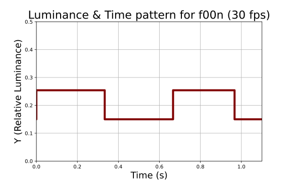
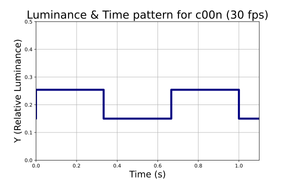
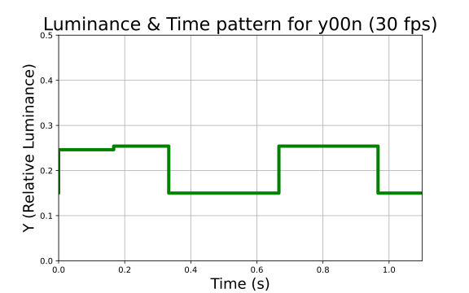
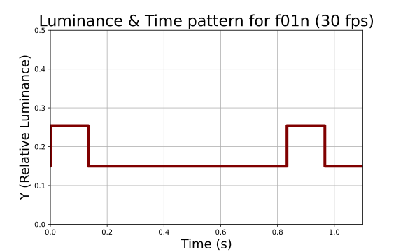
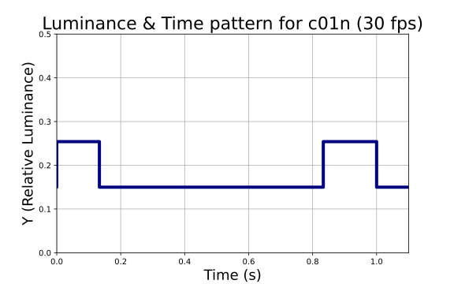
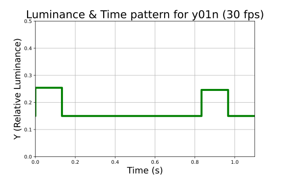
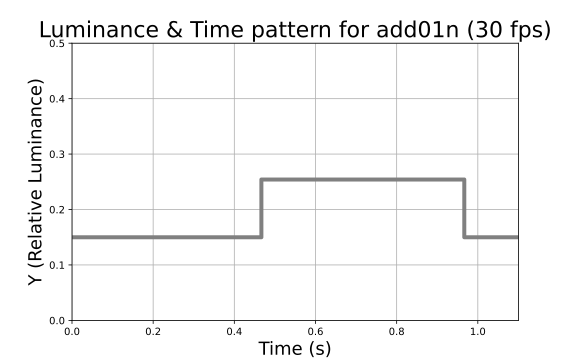
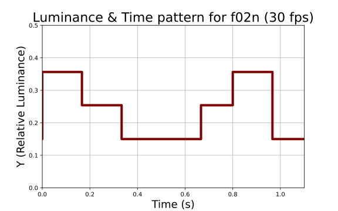
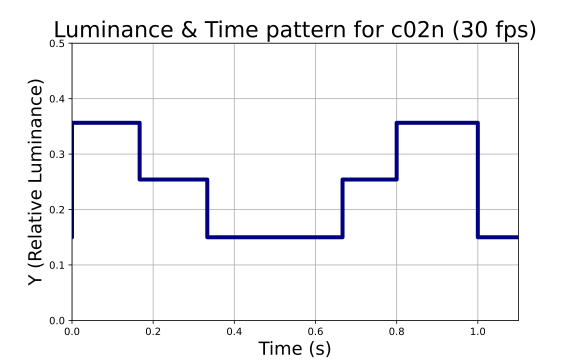
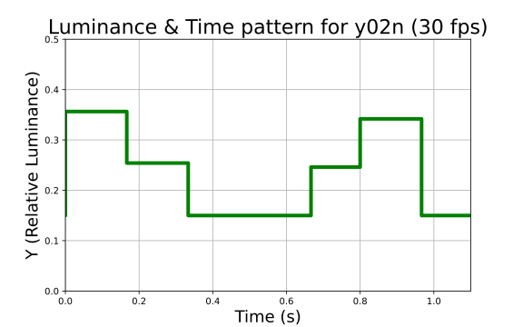

# Scene change patterns for 0.1 relative luminance and >3 transitions/s thresholds

{!NOTE]
> Note: There is no current standard that checks for >3 scene changes with a relative luminance threshold of 0.1. The NAB-J is the only standard that has a check for scence changes, but it uses different luminance thresholds.

All source CSV files in this folder are patterns for testing the luminance flash thresholds:
 - luminance threshold of 0.1 relative luminance (RL)
 - transition threshold of >3 *alternating* transitions per second

Filenames that start with 
 - `f*` are failing - fail luminance threshold (0.1 RL) and fail count threshold (>3 transitions/s)
 - `c*` are passing - fail luminance threshold (0.1 RL) and pass count threshold (>3 transitions/s)
 - `y*` are passing - pass luminance threshold with only one flash in the sequence below threshold (0.1 RL) and fail count threshold (>3 flash/s)
 - `add01*` is an add-on pattern intended to be used with an equivalent `f01*` pattern. This add-on should be a passing area for a test of the area threshold (ordinarily failing patterns will pass if the add-on pattern is added.)

For any failing pattern incorporated into a video, 
the area threshold needs to be failing (operationalized as >80% of the screen) 
for the video sequence to fail.

## Patterns
Representations of temporal-color patterns.

| Scheme | Description | *f* - Failure | *c* - Flash Count Pass | *y* - Single Lum. Pass |
| --- | --- | --- | --- | --- | 
| *x*00*n*_ 30fps_srgba. csv | Square wave (nearly so) |  |  |  | 
| *x*01*n*_ 30fps_srgba. csv | 2 transitions, wide space, 2 more transitions |  |  |  | 
| add01*n*_ 30fps_srgba. csv | Add-on transition (intended for a passing area) |  | n/a | n/a |
| *x*02*n*_ 30fps_srgba. csv | Various multi-step flashes where each step does/doesn't exceed luminance threshold (checks if alternating transitions are being counted properly) |  |  |  | 
